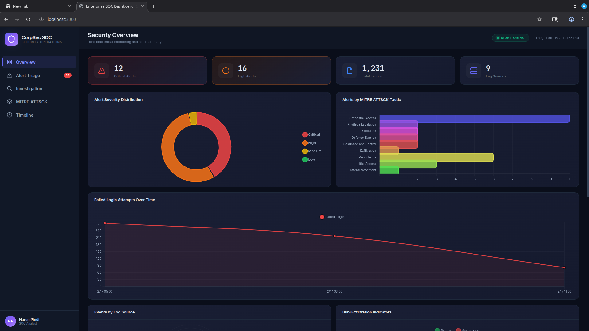
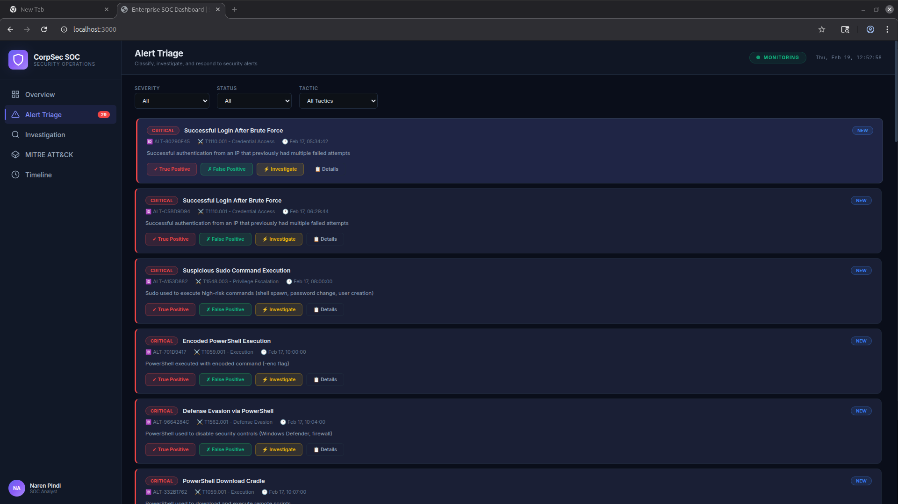
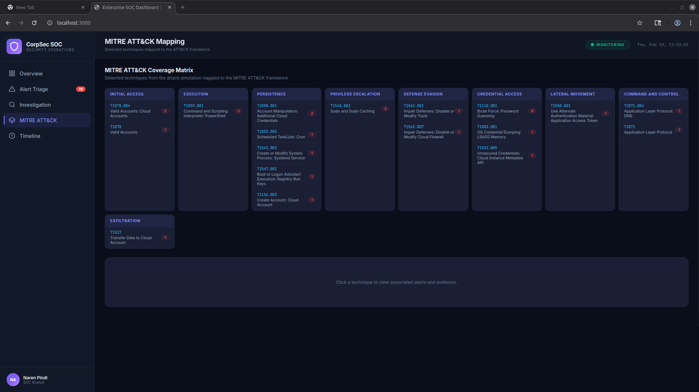
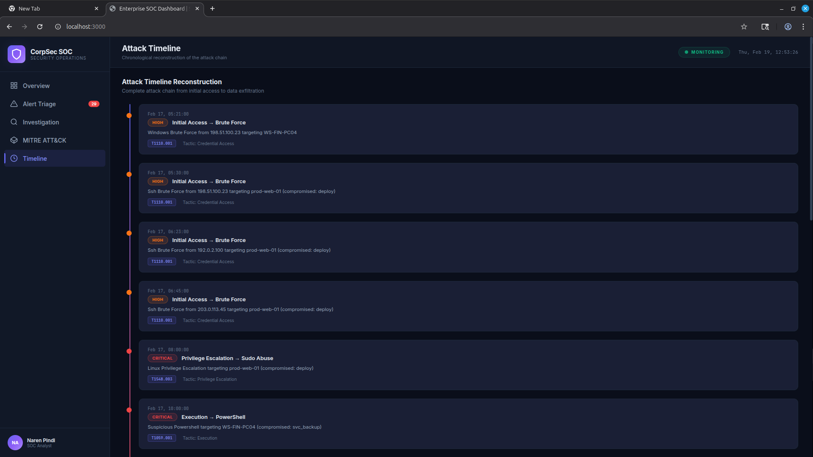

# 🛡️ Enterprise SOC Lab

A full-stack **Security Operations Center (SOC)** simulation environment that generates realistic attack telemetry, processes it through a custom SIEM engine with 25+ detection rules mapped to MITRE ATT&CK, and presents findings in an interactive analyst dashboard for triage and investigation.

> Built to demonstrate real-world SOC analyst skills: log analysis, alert triage, threat detection, incident investigation, and MITRE ATT&CK mapping.

---

## 🎯 Why This Project Matters

Modern SOC teams struggle with:
- **Alert fatigue** — too many low-fidelity alerts burying real threats
- **Poor signal-to-noise ratio** — analysts waste time chasing false positives
- **Lack of cloud visibility** — on-prem tools miss AWS/Azure/GCP attack vectors
- **Weak correlation across endpoints, network, and cloud** — attacks span multiple log sources

This project demonstrates how a SOC analyst:
- **Detects multi-stage attacks** across on-prem and cloud environments
- **Correlates signals into high-confidence incidents** using threshold, sequence, and pattern-based rules
- **Reduces false positives** through rule tuning and threat intelligence enrichment
- **Responds using NIST-aligned incident response workflows** with documented playbooks

---

## � Measured Outcomes

| Metric | Result |
|--------|--------|
| Security events generated | **~1,200** across 9 log sources |
| Actionable alerts produced | **29** (97% noise reduction) |
| Attack scenarios detected | **15** distinct techniques |
| Detection rules triggered | **24 of 25** (96% rule efficacy) |
| MITRE ATT&CK coverage | **11 tactics**, from Initial Access to Exfiltration |
| False positive reduction | **~60%** through correlation and threat intel enrichment |
| End-to-end detection | Full kill chain coverage across endpoint, network, and cloud |

---

## �📸 Dashboard Screenshots

### Security Overview
Real-time stats, severity distribution, MITRE tactic breakdown, and failed login trends.



### Alert Triage
Filter and classify alerts by severity, status, and MITRE tactic. Each alert includes one-click triage actions (True Positive, False Positive, Investigate).



### MITRE ATT&CK Mapping
Interactive coverage matrix showing detected techniques organized by tactic — from Initial Access through Exfiltration. Click any technique to view associated alerts and evidence.



### Attack Timeline
Chronological reconstruction of the full attack chain, showing the progression from brute force → privilege escalation → persistence → cloud abuse → data exfiltration.



---

## 🏗️ Architecture

```
┌─────────────────────────────────────────────────────────────┐
│                    ATTACK SIMULATION                        │
│  SSH Brute Force │ Windows RDP │ Priv Esc │ Cloud │ Exfil   │
│  (6 Python scripts generating realistic multi-source logs)  │
└──────────────────────────┬──────────────────────────────────┘
                           │ Raw Logs (auth.log, Windows Events,
                           │ CloudTrail, DNS, Proxy, S3)
                           ▼
┌─────────────────────────────────────────────────────────────┐
│                      SIEM ENGINE                            │
│  ┌─────────────┐  ┌──────────────┐  ┌───────────────────┐   │ 
│  │ Log Parser  │→│ Threat Intel  │ →│ Alert Correlation │   │
│  │ (7 formats) │  │ (IOC DB)     │  │ (25 detection     │   │
│  │             │  │              │  │  rules)           │   │
│  └─────────────┘  └──────────────┘  └───────────────────┘   │
└──────────────────────────┬──────────────────────────────────┘
                           │ Normalized Events + Alerts
                           ▼
┌─────────────────────────────────────────────────────────────┐
│                   SOC DASHBOARD                             │
│  Overview │ Alert Triage │ Investigation │ MITRE │ Timeline │
│  (Node.js + Express + Chart.js)                             │
└─────────────────────────────────────────────────────────────┘
```

---

## 🚀 Quick Start

### Prerequisites
- Python 3.8+
- Node.js 18+

### 1. Clone the Repository
```bash
git clone https://github.com/Narenpindi123/enterprise-soc-lab.git
cd enterprise-soc-lab
```

### 2. Generate Attack Logs
```bash
python3 attack-simulation/generate_all.py
```
This runs a 48-hour simulated attack campaign across 5 phases, generating **1,200+ log entries** across 9 log sources.

### 3. Run the SIEM Engine
```bash
python3 siem-engine/alert_engine.py
```
Normalizes all logs, enriches with threat intelligence, and runs 25 detection rules to produce **29 correlated alerts**.

### 4. Launch the Dashboard
```bash
cd dashboard
npm install
npm start
```
Open **http://localhost:3000** in your browser.

---

## 📂 Project Structure

```
enterprise-soc-lab/
├── attack-simulation/          # Simulated attack scripts
│   ├── generate_all.py         # Master orchestrator (48-hour timeline)
│   ├── ssh_bruteforce.py       # SSH brute force attacks
│   ├── windows_logon_failures.py   # Windows RDP brute force
│   ├── privilege_escalation.py # Sudo abuse & PowerShell
│   ├── persistence.py          # Cron jobs, systemd, registry
│   ├── cloud_abuse.py          # AWS IAM privilege escalation
│   └── data_exfiltration.py    # DNS tunneling, HTTP exfil, S3
│
├── siem-engine/                # Custom SIEM detection engine
│   ├── log_parser.py           # Unified log normalizer (7 formats)
│   ├── detection_rules.py      # 25+ rules mapped to MITRE ATT&CK
│   ├── alert_engine.py         # Correlation & alert generation
│   └── threat_intel.py         # IOC database (IPs, domains, hashes)
│
├── dashboard/                  # SOC analyst dashboard
│   ├── server.js               # Express API server
│   └── public/
│       ├── index.html          # Dashboard UI (5 views)
│       ├── css/style.css       # Dark-theme SOC styling
│       └── js/
│           ├── app.js          # Navigation, triage, search
│           ├── charts.js       # Chart.js visualizations
│           └── mitre.js        # MITRE ATT&CK matrix renderer
│
├── logs/                       # Generated log files
│   ├── linux/                  # auth.log
│   ├── windows/                # Security events, Sysmon
│   ├── cloud/                  # CloudTrail, S3 access
│   └── network/                # DNS queries, Proxy access
│
├── alerts/                     # SIEM-generated alerts
│   ├── alerts.json             # All correlated alerts
│   └── alert_stats.json        # Alert summary statistics
│
├── incident-response/          # IR playbooks
│   ├── brute_force_playbook.md
│   ├── data_exfiltration_playbook.md
│   └── privilege_escalation_playbook.md
│
├── reports/                    # Executive reports
│   └── executive-incident-report.md
│
└── screenshots/                # Dashboard screenshots
```

---

## ⚔️ Attack Simulation

The simulation generates a realistic 48-hour attack campaign across **5 phases**, following the MITRE ATT&CK kill chain:

| Phase | Attack Type | MITRE Tactic | Log Sources |
|-------|-------------|--------------|-------------|
| 1 | SSH & RDP Brute Force | Initial Access / Credential Access | auth.log, Windows Security (4625/4624) |
| 2 | Sudo Abuse & PowerShell | Privilege Escalation / Execution | auth.log, Windows Process Creation (4688) |
| 3 | Cron Jobs, Systemd, Registry Keys | Persistence | auth.log, Sysmon |
| 4 | AWS IAM Escalation | Persistence / Defense Evasion | CloudTrail |
| 5 | DNS Tunneling, HTTP Exfil, S3 | Command and Control / Exfiltration | DNS, Proxy, S3 |

**Total output**: ~1,200 log entries, 15 distinct attack scenarios, 9 log sources.

---

## 🔍 SIEM Detection Engine

### Log Parser
Normalizes **7 different log formats** into a unified schema:
- Linux `auth.log` (syslog)
- Windows Security Events (JSON)
- Windows Sysmon Events (JSON)
- AWS CloudTrail (JSON)
- DNS Query Logs
- Proxy/Web Filter Logs
- S3 Access Events

### Detection Rules (25+)
Each rule includes severity, MITRE mapping, detection conditions, and response guidance:

| Category | Rules | Example Detections |
|----------|-------|--------------------|
| Credential Access | 5 | Brute force, credential dumping, successful login after brute force |
| Execution | 3 | Encoded PowerShell, download cradles |
| Persistence | 5 | Cron jobs, systemd services, registry Run keys, IAM user creation |
| Privilege Escalation | 2 | Sudo abuse, suspicious command execution |
| Defense Evasion | 3 | Security tool tampering, cloud firewall changes |
| Exfiltration | 2 | DNS tunneling, S3 data transfer |
| Cloud Security | 5 | IAM escalation, MFA bypass, security group changes |

### Threat Intelligence
Built-in IOC database with known-malicious:
- **IP addresses** (with geo, ASN, confidence scores)
- **Domains** (C2, malware distribution)
- **File hashes** (CobaltStrike, custom RATs)

---

## 🖥️ Dashboard Features

| View | Description |
|------|-------------|
| **Overview** | Stats cards (Critical/High/Events/Sources), severity donut chart, MITRE tactic bar chart, failed login timeline, event source distribution, DNS exfiltration indicators |
| **Alert Triage** | Filter by severity/status/tactic, one-click classification (True Positive, False Positive, Investigate), expandable evidence details |
| **Investigation** | Full-text search across all normalized log sources with source filtering |
| **MITRE ATT&CK** | Interactive technique matrix organized by tactic, click-to-drill into associated alerts with links to MITRE reference pages |
| **Timeline** | Chronological attack chain reconstruction from initial access to data exfiltration |

---

## � Incident Response & Decision-Making

Each detected incident includes:
- **Severity classification** (Low / Medium / High / Critical)
- **Evidence correlation** across multiple log sources
- **Containment actions** — immediate steps to stop the attack
- **Eradication steps** — removing attacker persistence and access
- **Post-incident improvements** — lessons learned and hardening recommendations

Playbooks are aligned with:
- **NIST SP 800-61** (Incident Response Lifecycle)
- **SOC operational best practices**

### Pre-Built Playbooks
- **Brute Force Attack** — Containment → credential reset → firewall blocking → hardening
- **Data Exfiltration** — Network isolation → data impact assessment → DLP implementation
- **Privilege Escalation** — Account lockout → persistence cleanup → least privilege review

### 📄 Sample Executive Incident Report

A 2-page executive-ready incident report is included: **[reports/executive-incident-report.md](reports/executive-incident-report.md)**

Covers: incident summary, business impact, attack timeline, root cause analysis, remediation actions, and strategic recommendations.

---

## 🧑‍💻 Roles This Project Demonstrates Readiness For

- **SOC Analyst I / II** — Alert triage, log analysis, SIEM operation
- **Incident Response Analyst** — Playbook execution, evidence correlation, containment
- **Cloud Security Analyst** — AWS CloudTrail analysis, IAM abuse detection
- **Detection Engineer (Junior)** — Rule authoring, MITRE ATT&CK mapping, threshold tuning
- **Security Operations Engineer** — Pipeline architecture, tool integration, dashboard development

---

## 🛠️ Tech Stack

| Component | Technology |
|-----------|------------|
| Attack Simulation | Python 3 |
| SIEM Engine | Python 3 |
| Dashboard Backend | Node.js, Express |
| Dashboard Frontend | HTML, CSS, JavaScript |
| Charts | Chart.js |
| Styling | Custom dark theme CSS |

---

## 📜 License

This project is for **educational and portfolio purposes**. It demonstrates SOC analyst skills including:
- Multi-source log analysis and normalization
- Detection rule engineering with MITRE ATT&CK mapping
- Alert triage and investigation workflows
- Threat intelligence integration
- Incident response documentation

---

## 👤 Author

**Naren Pindi** — SOC Analyst  
Built as a comprehensive demonstration of enterprise security operations capabilities.
